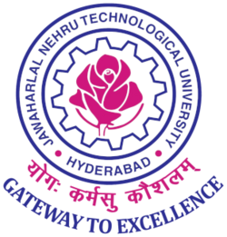

  

  # UEMS:University Examination Management System

  **A comprehensive full-stack platform to modernize campus operations for JNTUH**

  
  
  
  
  
  

---

## Overview

UEMS is a full-stack University Examination Management System built for **JNTU Hyderabad** as a Final Year B.Tech CSE Major Project. It replaces fragmented, manual processes with a unified digital ecosystem featuring three dedicated role-based portals for **Admins**, **Faculty**, and **Students** — all secured with JWT authentication.

> Built with **Java Spring Boot** (backend) · **React + Vite** (frontend) · **PostgreSQL on Neon** (database)

---

## Features

### Admin Portal
- Manage the entire university roster (students, faculty)
- **Bulk user onboarding** via Excel (`.xlsx`) import using Apache POI
- Smart **batch enrollment** — auto-pairs students with courses by year & semester in one click
- Exam scheduling, result publishing, and fee notification management
- **Advanced analytics**: department-wide performance, grade distributions, Gold Medalist identification

### Faculty Portal
- Manage assigned courses and track student **attendance**
- Upload **chapter-wise study materials**
- Controlled **marks entry** with locking/publishing workflow for result integrity
- Subject-level analytics: pass %, grade distributions, IDOR-safe data isolation

### Student Portal
- Personalized dashboard for attendance, internal/external marks, and notifications
- View semester-wise **results** and academic history
- **Online fee payments** via integrated gateway
- Access study materials uploaded by instructors
- **Document store** for personal academic documents

### Smart Features
- **AI Chatbot** — "UEMS Assistant" powered by the **Gemini 2.5 Flash API** for real-time, context-aware support
- Secure **password recovery** via email (UUID token, 15-min expiry, one-time use)
- SMTP email automation for exam, result, and fee notifications

---

## Tech Stack

| Layer | Technology |
|---|---|
| **Frontend** | React 18, Vite, Tailwind CSS, Axios, Recharts |
| **Backend** | Java 17, Spring Boot 3.x, Spring Security |
| **Database** | PostgreSQL (Neon Cloud), JPA/Hibernate |
| **Auth** | JWT (Stateless) + BCrypt password hashing |
| **Email** | Gmail SMTP via Spring JavaMailSender |
| **File Processing** | Apache POI (Excel imports), Multipart file upload |
| **AI Integration** | Google Gemini 2.5 Flash API |

---

## Security Architecture

- **Stateless JWT Authentication** — every API request carries a signed Bearer token encoding the user's role
- **Role-Based Access Control (RBAC)** — `Admin`, `Faculty`, `Student` permissions enforced at both the controller (`@PreAuthorize`) and frontend (`ProtectedRoute.jsx`) levels
- **BCrypt** password hashing (strength 10) — passwords never stored in plain text
- **Password Reset** — UUID tokens with 15-minute expiry, one-time use, delivered via Gmail SMTP
- **Axios Interceptor** — catches all `401` responses and redirects to login with a session-expired toast

---

##  Feature Modules

| Module | Description |
|---|---|
| **Authentication & User Mgmt** | JWT login, RBAC, bulk onboarding via Excel, password recovery |
| **Academic Structure** | Course management, faculty assignment, batch enrollment |
| **Examination & Results** | Exam creation, scheduling, marks entry, result publishing |
| **Student Services** | Attendance tracking, materials, payments, document store |
| **Analytics & Reporting** | Department analytics, year/semester analytics, grade distributions |
| **Smart Features** | AI chatbot (Gemini), SMTP notifications, file uploads |

---

##  Team

Final Year B.Tech CSE JNTUH

| Name | Roll Number |
|---|---|
| K. Manasvi Reddy | 22011A0510 |
| M. Rishika Reddy | 22011A0520 |
| S. Sai Akshitha | 22011A0523 |
| T. Sri Sreshta | 22011A0524 |

**Mentor:** Dr. K. Suresh Babu

---
