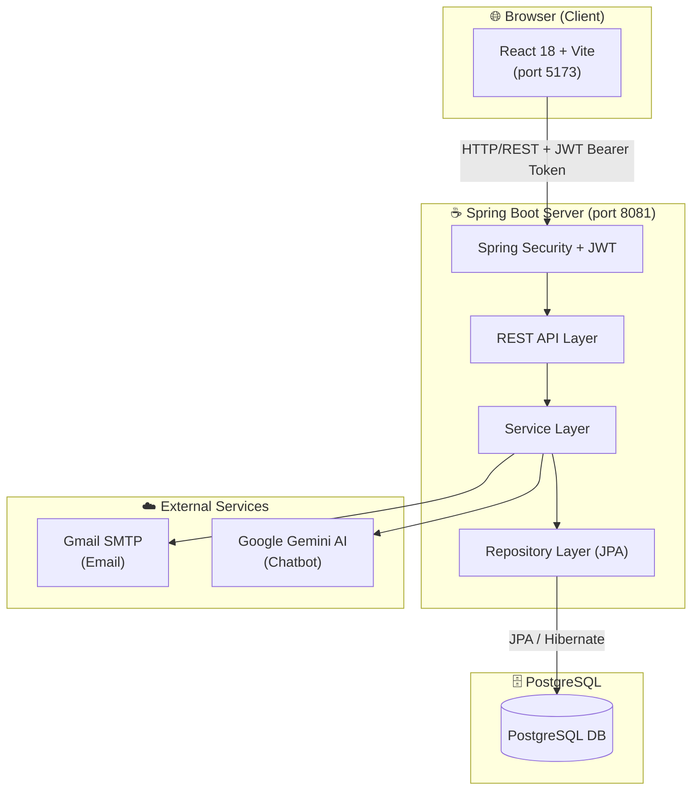
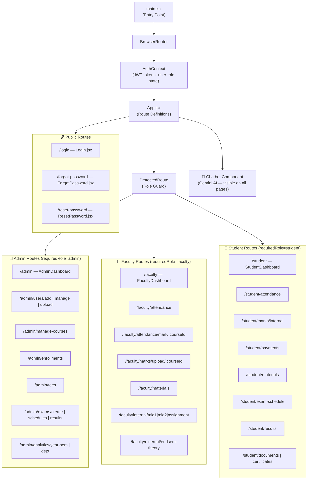
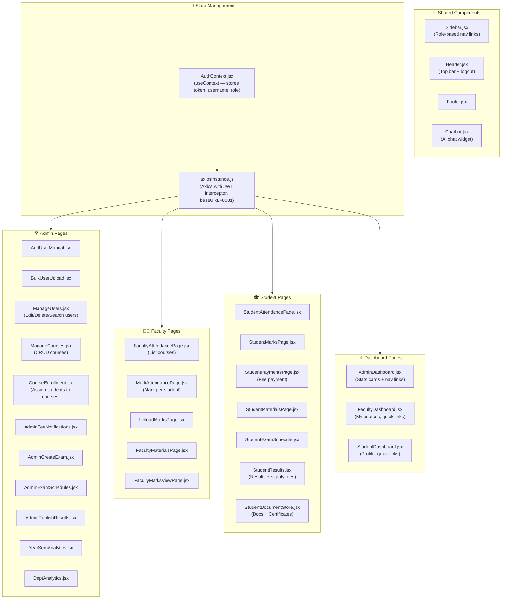
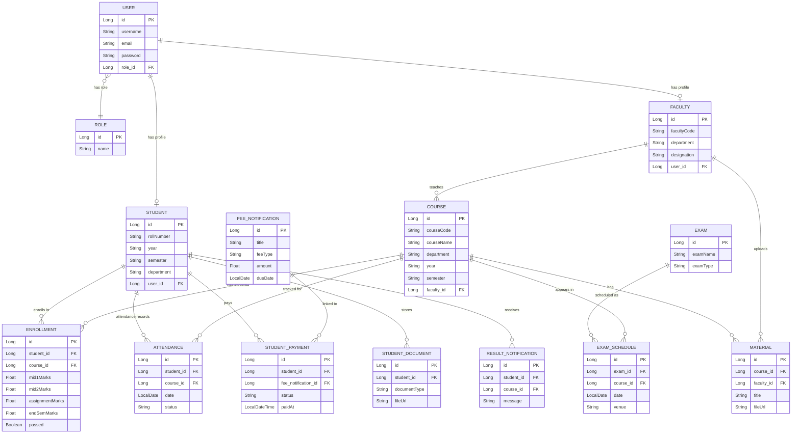
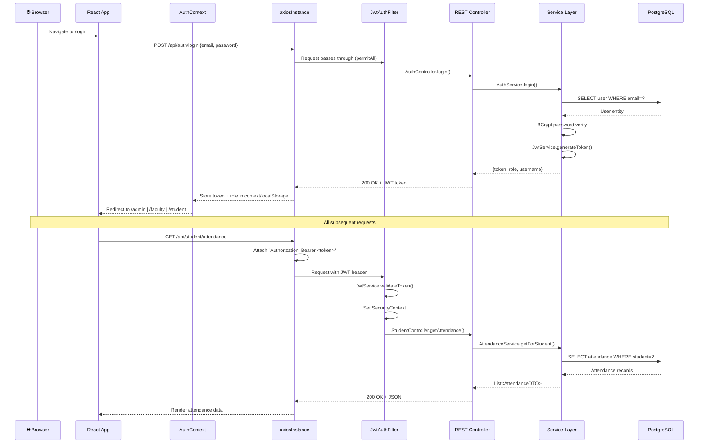
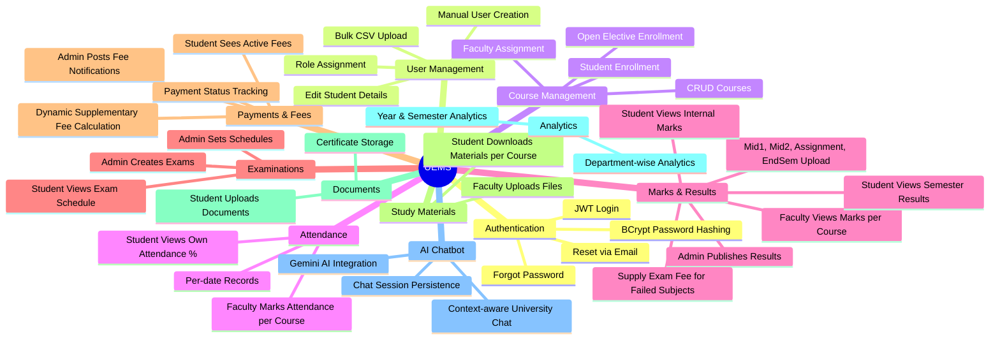

# UEMS — University Examination Management System
## Architectural Flow

---

## 1. System Overview

UEMS is a full-stack web application with a **React (Vite)** frontend and a **Spring Boot** backend, backed by **PostgreSQL**, communicating via a **REST API** secured with **JWT**.

---

## 2. Frontend Architecture

---

## 3. Frontend Component Architecture

---

## 4. Backend Architecture (Spring Boot)

```mermaid
graph TD
    subgraph EntryPoint["🚀 Entry Point"]
        UemsApplication["UemsApplication.java\n(@SpringBootApplication)"]
        DataLoader["DataLoader.java\n(Seeds: roles, admin, default users on startup)"]
    end

    subgraph SecurityLayer["🔐 Security Layer"]
        SecurityConfig["SecurityConfig.java\n(CORS, JWT filter chain, STATELESS session)"]
        JwtFilter["JwtAuthenticationFilter.java\n(Validates JWT on every request)"]
        JwtService["JwtService.java\n(Generate/validate JWT tokens)"]
        UserDetailsService["CustomUserDetailsService.java\n(Loads User by username from DB)"]
    end

    subgraph ControllerLayer["🎮 Controller Layer (REST Endpoints)"]
        AuthController["AuthController\n/api/auth/**\n(login, register, forgot-pwd, reset-pwd)"]
        AdminController["AdminController\n/api/admin/**\n(user CRUD, analytics)"]
        AdminExamController["AdminExamController\n/api/admin/exams/**\n(create exam, schedule, publish results)"]
        AdminFeeController["AdminFeeController\n/api/admin/fees/**"]
        AttendanceController["AttendanceController\n/api/attendance/**"]
        CourseController["CourseController\n/api/courses/**"]
        FacultyController["FacultyController\n/api/faculty/**\n(courses, marks, materials)"]
        PaymentController["PaymentController\n/api/payments/**"]
        StudentController["StudentController\n/api/student/**\n(profile, marks, attendance, results)"]
        StudentDocumentController["StudentDocumentController\n/api/student/documents/**"]
        StudentExamController["StudentExamController\n/api/student/exams/**"]
        StudentNotificationController["StudentNotificationController\n/api/student/notifications/**"]
        ChatController["ChatController\n/api/chat/**"]
    end

    subgraph ServiceLayer["⚙️ Service Layer"]
        AuthService["AuthService\n(Login, JWT generation, password reset tokens)"]
        AdminService["AdminService\n(User management, enrollment, bulk ops, analytics)"]
        AttendanceService["AttendanceService\n(Mark & fetch attendance records)"]
        CourseService["CourseService\n(CRUD for courses)"]
        FacultyService["FacultyService\n(Faculty profile lookups)"]
        EmailService["EmailService\n(Password reset emails via Gmail SMTP)"]
        AIService["AIService\n(Gemini AI API calls for chatbot)"]
        ChatService["ChatService\n(Chat session & message handling)"]
    end

    subgraph RepositoryLayer["🗄️ Repository Layer (Spring Data JPA)"]
        UserRepo["UserRepository"]
        StudentRepo["StudentRepository"]
        FacultyRepo["FacultyRepository"]
        CourseRepo["CourseRepository"]
        EnrollmentRepo["EnrollmentRepository"]
        AttendanceRepo["AttendanceRepository"]
        ExamRepo["ExamRepository"]
        ExamScheduleRepo["ExamScheduleRepository"]
        FeeNotifRepo["FeeNotificationRepository"]
        MaterialRepo["MaterialRepository"]
        StudentPaymentRepo["StudentPaymentRepository"]
        StudentDocRepo["StudentDocumentRepository"]
        ResultNotifRepo["ResultNotificationRepository"]
        RoleRepo["RoleRepository"]
    end

    UemsApplication --> DataLoader
    UemsApplication --> SecurityConfig
    SecurityConfig --> JwtFilter
    JwtFilter --> JwtService
    JwtFilter --> UserDetailsService
    UserDetailsService --> UserRepo

    JwtFilter --> ControllerLayer

    AuthController --> AuthService
    AdminController --> AdminService
    AdminExamController --> AdminService
    AdminFeeController --> AdminService
    AttendanceController --> AttendanceService
    CourseController --> CourseService
    FacultyController --> FacultyService
    PaymentController --> AdminService
    StudentController --> AdminService
    StudentDocumentController --> AdminService
    StudentExamController --> AdminService
    StudentNotificationController --> AdminService
    ChatController --> ChatService
    ChatService --> AIService

    AuthService --> EmailService
    AuthService --> UserRepo
    AdminService --> UserRepo
    AdminService --> StudentRepo
    AdminService --> FacultyRepo
    AdminService --> CourseRepo
    AdminService --> EnrollmentRepo
    AdminService --> AttendanceRepo
    AdminService --> ExamRepo
    AdminService --> ExamScheduleRepo
    AdminService --> FeeNotifRepo
    AdminService --> MaterialRepo
    AdminService --> StudentPaymentRepo
    AdminService --> StudentDocRepo
    AdminService --> ResultNotifRepo
    AttendanceService --> AttendanceRepo
    AttendanceService --> EnrollmentRepo
    CourseService --> CourseRepo
    FacultyService --> FacultyRepo
```

---

## 5. Database Schema (Entity Relationships)

---

## 6. Authentication & Request Flow

---

## 7. Role-Based Access Control (RBAC) Map

| Role | Dashboard | Key Capabilities |
|------|-----------|-----------------|
| **ADMIN** | `/admin` | Create/edit/delete users, bulk upload via CSV, manage courses, enroll students, set exam schedules, publish results, send fee notifications, view analytics |
| **FACULTY** | `/faculty` | View assigned courses, mark student attendance, upload marks (Mid1, Mid2, Assignment, EndSem), upload study materials |
| **STUDENT** | `/student` | View attendance %, view internal marks, check exam schedule, view results, pay fees, download materials, store documents/certificates |

---

## 8. Key Feature Modules

---

## 9. Technology Stack Summary

| Layer | Technology |
|-------|-----------|
| **Frontend** | React 18, Vite, React Router v6, Axios |
| **Styling** | CSS / Tailwind (mixed), custom components |
| **State** | React Context API (AuthContext) |
| **Backend** | Spring Boot 3, Spring Security, Spring Data JPA |
| **Auth** | JWT (HMAC-SHA256), BCrypt password hashing |
| **Database** | PostgreSQL (HikariCP connection pool) |
| **Email** | Spring Mail → Gmail SMTP (TLS) |
| **AI** | Google Gemini API (chatbot) |
| **File Uploads** | Multipart (max 5MB), stored at `/uploads/**` |
| **Build** | Maven (server), Vite/npm (client) |
| **Ports** | Frontend: 5173, Backend: 8081 |
